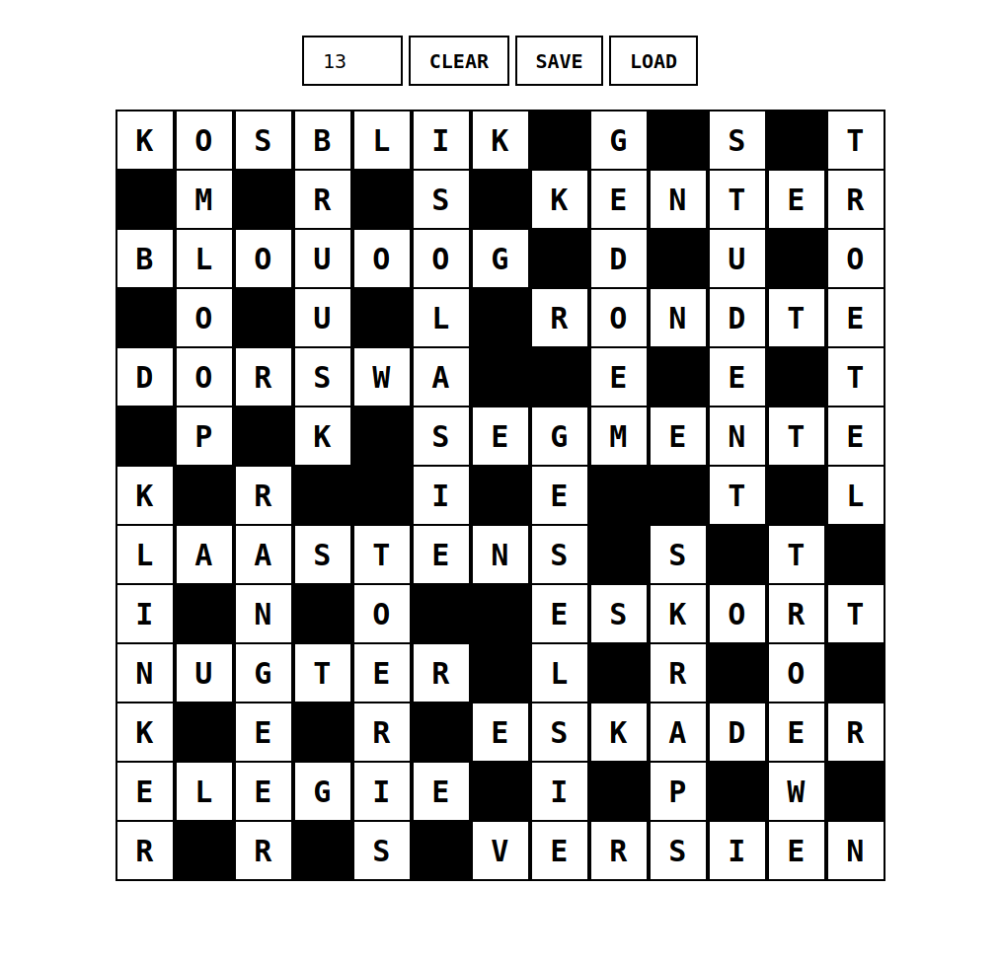

# Crossword

Simple app to create, complete and share crossword puzzles. Built with Vue.

Requires a modern browser.

## Usage

Add a \` (backtick) to a cell to make it black.
Navigate with arrow keys.

## Example

## TODO

- Add some tools like a scratchpad or generate possible word permutations
- Service worker for offline usage
- Remove framework?